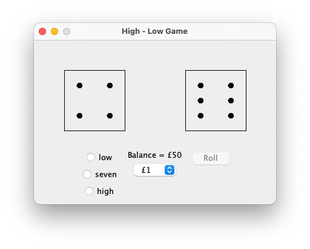

<h1 align="center">Dice Guessing Game</h1>

<strong>An interactive game written from scratch in Java</strong>

</img>

<h2>About</h2>

Beginning with £50, the player must wager whether the sum of two dice will be higher, lower, or equal to the median number 7. If wagering the roll will be a 7, then the result is multiplied by 4. The game ends when the player has no money left to wager, so the old saying stands - the house always wins. This program was written during Bangor University's autumn 2019 Advanced Java Course.

<h2>Goal and requirements</h2>

The goal of this project was to create a properly functioning and interactive program implementing the knowledge of Java's syntax, and graphics libraries learned during the semester. As the project progressed, Maven automated builds and iterations as new features were added. The project requirements included correctly calculating and displaying the dice values, receiving player input, and returning information to the player based on their decisions.

<h2>Key learnings</h2>

- Java AWT and Swing
- JPanel and JFrame
- Organizing, scaling, and spacing visuals to present the program in a logical manner
- Maven build automations

<h2>Installation and usage</h2>

1. Downlad the code in this repository
2. Compile and run the main method found in `DiceGameViewer.java` 